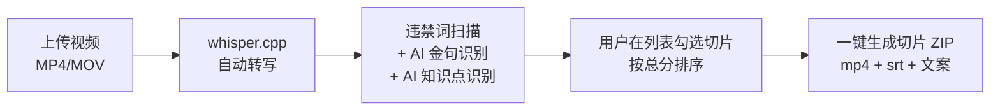

# 1. 项目概述

> 本文件是 PRD/ 文件夹的第 1 部分。如需了解产品全貌请先读 [README.md](./README.md)。
> 上一模块：— · 下一模块：[02-tech-stack.md](./02-tech-stack.md)

> 📌 本 PRD 性质：**逆向补 PRD** — 代码先于文档存在，本 PRD 跟当前代码现状 1:1 对齐，不引入未实现的功能。所有"V2 待办"在 [10-roadmap.md](./10-roadmap.md)。

---

## 1.1 产品名称

**video-slicer**（工作名）/ Product Hunt 上线名待定

## 1.2 一句话描述

把 1-4 小时的知识类直播录像，用 4 步生成"陌生观众能独立看懂"的金句切片 + 知识点切片，附带 0 编造的平台文案，下载即用。

## 1.3 核心价值主张

- **用户痛点**：知识类直播博主结束后面对长录像无从切起 — 人工回看 30-60 分钟才能找出 1-2 条可发短视频
- **我们的解法**：4 步全自动（上传 → 转写 → AI 识别 + 评分 → 下载切片包），核心是 **V4 版 Prompt 的"完整可独立理解片段"识别能力**
- **差异化护城河**（vs 录咖 / OpusClip）：
  - 录咖 / OpusClip 切的是"按时间窗的碎片"
  - 我们做了 4 件他们没做的事：
    1. **合并 whisper 语义碎片** — ASR 按 2 秒停顿切碎，必须先合并成完整句再判断
    2. **指代词回溯到具体概念** — "这个方法"必须往前找到"结构化思维"
    3. **完整性硬规则** — 切片首尾不能是助词 / 连接词 / 代词
    4. **反 AI 编造硬规则** — 文案生成只允许基于原话，禁止虚构新观点
  - 这 4 条是从 12 个真实坑 + V1→V4 Prompt 迭代沉淀出的工程深度，详见 [APPENDIX-pitfalls.md](./APPENDIX-pitfalls.md)

## 1.4 目标用户

- **主要用户**：知识类直播博主（商业认知 / 职场 / AI 科技 / 心理 / 教育方向），每周 1-3 场直播，已经把直播作为短视频素材库
- **使用场景**：直播结束后 24 小时内，PC 端打开本产品 → 上传录像 → 喝杯咖啡的时间内拿到 5-15 条候选切片 → 自己挑选下载发布

> ⚠️ **定位风险已记录**：本定位基于"抖音砥砺计划扶持知识赛道"的机会驱动判断，**无真实知识类直播博主用户访谈数据**。唯一访谈对象是 1 名旅游博主（青木）。这是 V1 上线后必须用真实付费/留存数据修正的风险点。详见 [10-roadmap.md](./10-roadmap.md) §10.4 验证节点。

## 1.5 MVP 范围声明（V1 = 3 个核心功能）

### ✅ V1 做

1. **V1-F1 视频上传 + 自动转写**
   - 支持 MP4 / MOV，单文件 ≤ 4GB（实际受内存限制）
   - FFmpeg 提取 16kHz 单声道音频 → whisper.cpp medium 模型本地转写
   - 输出带时间戳的 segment 数组（精度 0.001 秒）
   - 〔已实现在 `backend/main.py:41-111` `/transcribe`〕

2. **V1-F2 AI 内容识别 + 6 维度评分**
   - 违禁词检测（基于本地 xlsx 词库 + AI 二校）
   - 金句识别（V4 prompt，输出 0-100 分 + 4 类标签）
   - 知识点段落识别（V4 prompt，输出 0-100 分 + 6 类标签 + 风险等级）
   - 评分体系：6 个维度（知识完整性 25 + 独立可理解性 20 + 学习价值 20 + 表达清晰度 15 + 时长适配性 10 + 安全合规 10）
   - 〔已实现在 `backend/main.py:370-540`〕

3. **V1-F3 切片导出 + 文案生成**
   - 用户在结果列表勾选要发的切片
   - 按 hh:mm:ss 时间戳切片（FFmpeg libx264 -preset slow -crf 18，视觉接近无损）
   - 同步生成 SRT 字幕 + 抖音/B 站双平台文案（COPY prompt 含"反编造"硬规则）
   - 下载 ZIP 包（mp4 + srt + 文案.json）
   - 〔已实现在 `backend/main.py:609-794`〕

### ❌ V1 不做（全部进 [10-roadmap.md](./10-roadmap.md)）

| 不做项 | 不做原因 |
|---|---|
| **竖屏 9:16 真裁剪**（去除前端"抖音版" tab）| 你已决定横屏直发；当前 `vertical.mp4` 只是 `clip.mp4` 的 shutil 复制，前端选项是误导 — 砍掉 |
| 多平台 OAuth 自动分发 | 抖音/小红书个人开发者无 API 资质；B 站/快手/视频号 OAuth 审核周期 5-10 工作日，1 周窗口不够 |
| 半自动跳转 + 剪贴板填充 | UX 复杂度高，对面试讲述无帮助 |
| 6 类知识点分类细分（概念/方法/误区/案例/工具/观点）| Prompt 已输出 type 字段，前端 V1 暂不做筛选 UI，列表统一显示 |
| 6 维度评分**横向展示**在列表卡片 | 列表只显总分；详情页展开看 6 维细分（折中方案，1 周可行）|
| 用户系统 / 登录 / 付费 | 教学项目无后端用户；本地匿名跑通即可 |
| 批量上传 / 定时识别 / 发布历史 | 单文件单次跑通是 MVP 边界 |
| 数据库（Postgres / Supabase）| 当前 localStorage + `videos/` 文件系统已够 V1；V2 多用户时迁移 |
| 多语言 i18n | 主用户中文；英文 UI 等海外推广再说 |

## 1.6 核心用户流程（≤ 5 步）

最短闭环：**5 步**。当前代码已经完整实现这条主线。

## 1.7 V1 验收标准（每个功能含验收点 + 不做清单）

### V1-F1 视频上传 + 自动转写
- ✅ 支持 MP4 / MOV，单文件 ≤ 4GB
- ✅ 上传后自动触发 FFmpeg 音频提取（16kHz mono）+ whisper.cpp 转写
- ✅ 1 小时直播录像处理 ≤ 5 分钟（CPU 模式，M 系列芯片）
- ✅ 输出 `segments[]`，每个 segment 含 `{start, end, text}` 三字段，时间戳精度 ≤ 0.5 秒
- ✅ 上传文件持久化到 `backend/videos/<video_id>.mp4` 供后续切片用
- ❌ **V1 不做**：FLV / AVI / TS / MKV 等其他格式；URL 直接拉取（仅本地上传）；增量上传 / 断点续传

### V1-F2 AI 内容识别 + 6 维度评分
- ✅ 违禁词检测：基于 `data/sensitive_words.xlsx` 词库做扫描 + AI 二校；命中的 segment 高亮提示
- ✅ 金句识别：V4 Prompt（合并碎片 + 指代回溯 + 完整性硬规则 + 4 类型标签 + 70+ 分数）
- ✅ 知识点识别：V4 Prompt（同上 + 6 类型标签 + 6 维度评分 0-100 + 风险等级 low/medium/high）
- ✅ 列表展示：**只显总分（0-100）+ 类型标签 + 时长**（不在列表横排 6 维）
- ✅ 详情页（用户点击展开）：展示 6 个维度的细分得分 + AI 推荐理由 + 风险说明
- ✅ 默认按总分 desc 排序，可切到按时间戳排序
- ❌ **V1 不做**：用户自定义评分权重；分维度独立筛选；评分修改建议反馈

### V1-F3 切片导出 + 文案生成
- ✅ 用户勾选 N 条切片（无上限，但建议单次 ≤ 10 条避免 API 限流）
- ✅ FFmpeg 切片：`libx264 -preset slow -crf 18 -c:a aac -b:a 192k -pix_fmt yuv420p -movflags +faststart`（已实现）
- ✅ 每条切片生成：`clip.mp4` + `subtitle.srt`（按 clip 内时间归零）+ 缩略图 `thumb.jpg`
- ✅ Claude 生成抖音 + B 站双版文案（COPY prompt 含反编造硬规则）
- ✅ 串行 + sleep 3s 间隔（避免 API 限流，已实现）
- ✅ 用户可手动编辑文案（保存到 localStorage）
- ✅ 一键下载 ZIP：`<video_id>_clips.zip` 包含所有 clip 目录
- ❌ **V1 不做**：竖屏裁剪；字幕烧录到画面（FFmpeg drawtext/subtitles 滤镜，踩坑 #9）；批量上传到云端

---

> 数据/坑位编号说明：本 PRD 引用的「坑 #1」～「坑 #12」对应 [APPENDIX-pitfalls.md](./APPENDIX-pitfalls.md)。
> 引用「V1～V4 Prompt」对应同附录 §「Prompt 迭代版本史」。
