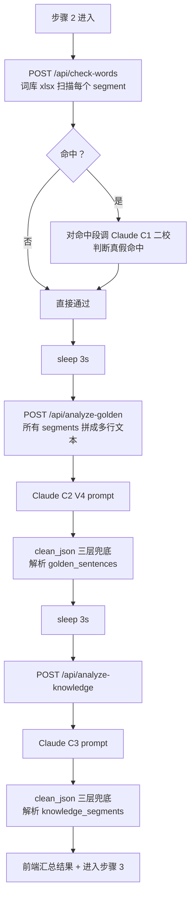

# 7. 核心业务逻辑

> 本文件是 PRD/ 文件夹的第 7 部分。如需了解产品全貌请先读 [README.md](./README.md)。
> 上一模块：[05-ai-capabilities.md](./05-ai-capabilities.md) · 下一模块：[09-error-handling.md](./09-error-handling.md)

---

## 7.1 主流程（端到端）

```mermaid
flowchart TD
    U[用户上传 MP4/MOV] -->|POST /transcribe| T1[后端: FFmpeg 提取音频<br/>16kHz mono pcm_s16le]
    T1 --> T2[whisper.cpp -m medium -l zh<br/>1h 视频 ≈ 3-5 分钟]
    T2 --> T3[正则清理时间戳标记<br/>组装 segments: Array<{start,end,text}>]
    T3 --> T4[保存原视频到 videos/&lt;id&gt;.mp4<br/>返回 segments + video_id]

    T4 --> S2[前端进入步骤 2]
    S2 -->|POST /api/check-words| W[违禁词扫描:<br/>本地词库 xlsx + AI 二校]
    S2 -->|sleep 3s 后<br/>POST /api/analyze-golden| G[Claude C2 金句识别<br/>V4 prompt: 合并碎片 + 指代回溯 + 完整性硬规则]
    G -->|sleep 3s 后<br/>POST /api/analyze-knowledge| K[Claude C3 知识点识别<br/>三段式 + 自闭环判断]

    K --> S3[前端进入步骤 3<br/>用户勾选切片 + 看 6 维度评分]
    S3 -->|POST /api/process-clips| P1[后端串行循环每条切片]
    P1 --> P2[FFmpeg 切片:<br/>libx264 preset slow CRF 18]
    P2 --> P3[生成 SRT 字幕<br/>清洗 segments 时间归零]
    P3 --> P4[Claude C4 双平台文案<br/>反编造硬规则]
    P4 -->|sleep 3s 下一条| P1

    P1 --> S4[前端进入步骤 4<br/>用户编辑文案 + 下载 ZIP]
    S4 -->|GET /api/download-package| Z[后端打包 ZIP:<br/>clip_NN/{mp4,srt,文案.json}]
```

**最短路径**：5 个用户动作完成端到端切片下载。

## 7.2 V1-F1 视频上传 + 自动转写

### 触发条件
用户在步骤 1 选好 MP4/MOV 文件后点"开始转写"。

### 处理流程

```mermaid
flowchart TD
    A[POST /transcribe<br/>multipart/form-data] --> B{后缀 ∈ {.mp4, .mov}}
    B -->|否| E1[400 仅支持 MP4 和 MOV]
    B -->|是| C[tempfile.TemporaryDirectory<br/>读 file 内容到磁盘]
    C --> D[FFmpeg -ar 16000 -ac 1 -c:a pcm_s16le<br/>提取标准 WAV]
    D -->|returncode != 0| E2[500 音频提取失败]
    D -->|成功| F[whisper-cli -m medium -l zh<br/>--output-json -t cpu_count]
    F -->|returncode != 0| E3[500 语音转写失败]
    F -->|成功| G[读 result.json<br/>组装 segments 数组]
    G --> H[uuid4 hex 取 8 字符 = video_id<br/>shutil.copy 持久化到 videos/]
    H --> I[200 返回 {segments, video_id}]
```

### 业务规则

- 同一时刻允许并发上传（教学项目，单用户场景），但**单进程 whisper.cpp 阻塞**，第二个上传会排队
- video_id = `uuid4().hex[:8]`（8 位 16 进制，足够 V1 阶段不冲突）
- segment 时间戳精度 = whisper 默认输出（毫秒级，转 float 秒）
- 上传文件**不删除** — `backend/videos/<video_id>.mp4` 永久保存供后续切片
- **隐私风险记录**：用户上传的视频内容包括直播原始音频会保留在本机硬盘，V1 没有自动清理机制（V2 加 7 天 TTL）

### 输入输出
- **输入**：multipart `file: File`
- **输出（成功）**：`{ segments: [{start, end, text}, ...], video_id: "abc12345" }`
- **输出（失败）**：HTTPException 4xx/5xx
- **副作用**：写 `backend/videos/<video_id>.mp4`

### 边界情况

| 场景 | 系统行为 | 用户感知 |
|---|---|---|
| 上传 .mov 但 macOS QuickTime 格式 | FFmpeg 通常能处理，正常完成 | 正常 |
| 上传 4GB 接近上限文件 | tempfile 占用磁盘 4GB+ 转录期间；可能 RAM OOM | 若失败 → 500 + 重试无意义 |
| 上传无音轨视频 | FFmpeg 提取出 0 字节 wav；whisper 返回空 segments | 返回 `{segments: []}` 让前端友好显示"未检测到语音" |
| 直播录像因 codec 异常 ffmpeg 不识别 | 500 音频提取失败 + stderr 尾 500 字符 | 错误信息直接展示 |
| video_id 碰撞（极低概率）| `shutil.copy2` 覆盖旧文件，旧 reading 失效 | 8 位 uuid 碰撞概率约 4×10⁻¹⁰，V1 接受 |

---

## 7.3 V1-F2 AI 内容识别（含 6 维度评分升级）

### 触发条件
转写成功后前端跳步骤 2，按顺序触发 3 个 API（实际为串行 + 3s 间隔，[踩坑 #7](./APPENDIX-pitfalls.md)）。

### 处理流程



### 业务规则

- **必须串行**：3 个 API 不能并发（[踩坑 #7](./APPENDIX-pitfalls.md) 蓝衣中转限流）
- **间隔 3 秒**：每两次 LLM 调用之间 `await asyncio.sleep(3)` (前端做的)
- **任一失败不阻塞其他**：违禁词失败 → 视为无命中继续；金句失败 → 跳过金句结果；知识点失败 → 同
- **6 维度评分（V1 升级，[05 §5.5](./05-ai-capabilities.md)）**：
  - 总分 = `completeness + independence + learning_value + clarity + duration_fit + compliance`
  - 总分 ≥ 75 → 进入候选列表（默认显示）
  - 总分 60-74 → 备选（用户开"显示全部候选"才看到）
  - 总分 < 60 → 不输出
- **风险等级处理**：
  - `compliance < 3` → `risk_level = high` → 列表卡片显红色警告图标 + 不参与推荐排序
  - `compliance 3-7` → `risk_level = medium` → 橙色提示图标
  - `compliance >= 8` → `risk_level = low` → 无图标

### 边界情况

| 场景 | 系统行为 |
|---|---|
| segments 数量 = 0（无语音直播）| 3 个 API 都返回空数组，前端显示"未识别到内容" |
| 整段直播都是带货/闲聊 | Claude 输出空数组，前端显示"本段直播未发现强金句/知识点" |
| Claude 限流（429）| `call_claude` 不重试，直接返回 fallback；前端显示"AI 识别暂时失败，可点重试" |
| Claude 输出非 JSON | `clean_json` 三层兜底，最后兜底返回 `{fallback_key: []}` |
| Claude 输出含中文引号（[踩坑 #6](./APPENDIX-pitfalls.md)） | `_sanitize_json_string` 转义后重试 |

---

## 7.4 V1-F3 切片导出 + 文案生成

### 触发条件
用户在步骤 3 勾选 N 条切片后点"生成切片"。

### 处理流程

```mermaid
flowchart TD
    A[POST /api/process-clips<br/>{video_id, clips: ClipItem[]}] --> B[查找 videos/&lt;id&gt;.{mp4,mov,MP4,MOV}]
    B --> LOOP[for each clip i in clips]

    LOOP --> C1[mkdir clip_&lt;i:02d&gt;/]
    C1 --> C2[FFmpeg 切片<br/>libx264 preset slow CRF 18<br/>aac 192k yuv420p faststart]
    C2 -->|失败| ERR[记录 clip_error,<br/>继续下一条不抛]
    C2 -->|成功| C3[shutil.copy clip.mp4 → vertical.mp4<br/>占位不真裁竖屏]

    C3 --> C4[FFmpeg 截中间帧 thumb.jpg<br/>-q:v 2 高质量]
    C4 --> C5[生成 subtitle.srt<br/>时间归零格式化]
    C5 --> C6[POST Claude C4 双平台文案]
    C6 --> C7[写 meta.json {clip_type, title}]
    C7 -->|i < len-1| SL[await asyncio.sleep 3]
    SL --> LOOP
    C7 -->|最后| RET[200 返回 clips 数组]
```

### 业务规则

- **切片用 input seeking + output cut**：`-ss start -to end` 放在 `-i` 后面（精准切，慢；input seeking 快但不精准）
- **画质保证**：CRF 18 + preset slow = 视觉接近无损；不允许 `-c copy` 直接复制流（开头帧可能找不到关键帧）
- **缩略图取中间帧**：用 input seeking（`-ss` 放 `-i` 前），速度快；`-q:v 2` 高质量 JPG
- **SRT 字幕处理**：当前实现仅用 `clip.text` 整段当一条字幕（[main.py:669](../backend/main.py#L669)）；**V1.1 改进**：从原始 segments 里截 [clip.start, clip.end] 范围内的 segments，按行做 SRT
- **每条 sleep 3 秒**：避免 Claude C4 文案生成限流
- **错误隔离**：单条切片失败 → 写入 `clip_error` 字段；其他切片继续处理；前端逐条显示成功/失败
- **vertical.mp4 = clip.mp4**：[main.py:650](../backend/main.py#L650) 仅 `shutil.copy2` 复制，**前端"抖音版" tab 不展示**（V1 砍）

### 边界情况

| 场景 | 系统行为 |
|---|---|
| 用户勾选 0 条 | 前端按钮置灰，不调 API |
| 用户勾选 50 条 | API 接受但实际 ~50 × (60s切片 + 10s文案 + 3s等待) ≈ 1 小时；前端显示进度条建议分批 |
| 切片时间戳超出视频时长 | FFmpeg 切到末尾即停，不报错；输出文件比预期短 |
| 视频文件被外部删除 | `_find_video_file` 抛 404；前端显示"原视频已丢失，请重新上传" |
| C4 文案生成失败 | `clip_error` 记录，文案降级为 `{title: clip.title, caption: ""}` |
| ZIP 打包时单 clip 缺文件 | `download-package` 跳过缺失文件继续打包，ZIP 用户能下载但少几条 |

---

## 7.5 状态机不变量

- 同一 `video_id` 的切片产物在 `videos/<id>/clip_<NN>/` 是 **append-only**（不会被改写或删除）
- 用户勾选状态、编辑过的文案都在前端 `localStorage`，后端无感知
- 用户清 localStorage（"重新开始"按钮）= 步骤回 1；后端 `videos/` 内文件仍在，磁盘逐渐变大（V2 加清理）

---

> 流程图用 Mermaid 渲染；GitHub / VS Code preview / Obsidian 都能正确显示。
